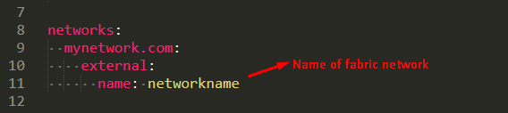
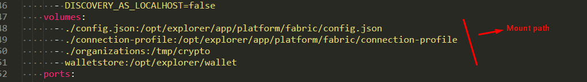

### I. Install
- Install postgressql: https://www.postgresql.org/download/linux/ubuntu/
- Install jq: lightweight and flexible command-line JSON processor
    sudo apt install jq
- Run create database script:
    ```sudo -u postgres ./createdb.sh```
- Install package
    ```./main.sh install```
- Run:
    ```npm start```


### Build docker

**Config compose**



**config connection-profile**
```
{
	"name": "test-network",
	"version": "1.0.0",
	"client": {
		"tlsEnable": true,
		"adminCredential": {
			"id": "exploreradmin",
			"password": "exploreradminpw"
		},
		"enableAuthentication": true,
		"organization": "org1nameMSP",
		"connection": {
			"timeout": {
				"peer": {
					"endorser": "300"
				},
				"orderer": "300"
			}
		}
	},
	"channels": {
		"channelname": {
			"peers": {
				"peer0.org1name": {}
			},
			"connection": {
				"timeout": {
					"peer": {
						"endorser": "6000",
						"eventHub": "6000",
						"eventReg": "6000"
					}
				}
			}
		}
	},
	"organizations": {
		"org1nameMSP": {
			"mspid": "org1nameMSP",
			"adminPrivateKey": {
				"path": "/tmp/crypto/peerOrganizations/org1name/users/Admin@org1name/msp/keystore/f6aa76db65dcfe9e61c5d9c1d64aaba4a1ad798e06faf064ccb352ec80907535_sk"
			},
			"peers": ["peer0.org1name"],
			"signedCert": {
				"path": "/tmp/crypto/peerOrganizations/org1name/users/Admin@org1name/msp/signcerts/Admin@org1name-cert.pem"
			}
		}
	},
	"peers": {
		"peer0.org1name": {
			"tlsCACerts": {
				"path": "/tmp/crypto/peerOrganizations/org1name/users/Admin@org1name/tls/ca.crt"
			},
			"url": "grpcs://peer0.org1name:7051",
			"grpcOptions": {
				"ssl-target-name-override": "peer0.org1name"
			}
		}
	}
}
```
- org1nameMSP, org1name: Lấy từ trong `devtool-community-network/artifact/config-explorer/config.json`
- /tmp/crypto/: Lấy từ mount path trong config compose

**Build docker image and run:**
`docker-compose up -d`

**Remove container, volumes**
`docker-compose down -v`

**Build docker images**

Add to docker-compose:
```
services:
  service1:
    build: .
    image: vondar/fabric-explorer  # goes to your repository on Docker Hub
```
`docker-compose up -d`
`docker-compose push service1`


---
### II. Troubershooting
#### 1. postgresql: 
```
psql: error: connection to server on socket "/var/run/postgresql/.s.PGSQL.5432" failed: No such file or directory.
Is the server running locally and accepting connections on that socket?
```
**Solution:**
> restart spostgres:
    sudo service postgresql start/stop/restart

#### 2. [DiscoveryService]: send[mychannel] - Channel:mychannel received discovery error:access denied
**Solution**
> 1. Delete wallet and rerun: `npm start`
> 2. Check log peer container: `got query for channel mychannel from 172.20.0.1:59992 but it doesn't exist`
Run createNetwork with channel Created: `./network.sh up createChannel`
Rerurn: `npm start`
#### 3. [SingleQueryHandler]: evaluate: message=Query failed. Errors: ["Error: Peer peer0.org1name is not running chaincode _lifecycle"], stack=FabricError: Query failed. Errors: ["Error: Peer peer0.org1name is not running chaincode _lifecycle"]
**Solution**
> 1. Check log peer container
> 2. check config test-network.json


###
Postgresql command:
```
sudo -i -u postgres

```


https://eplt.medium.com/5-minutes-to-install-hyperledger-explorer-with-fabric-on-ubuntu-18-04-digitalocean-9b100d0cfd7d